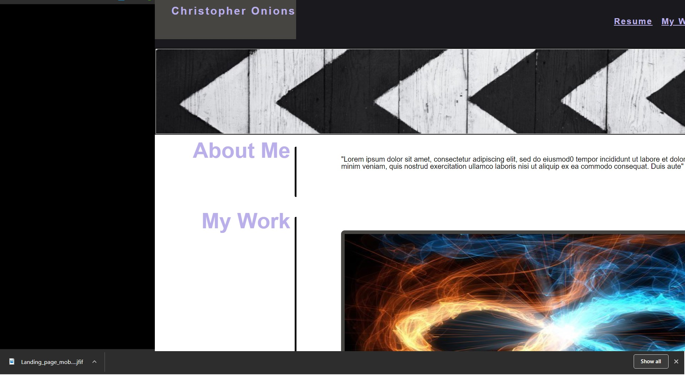
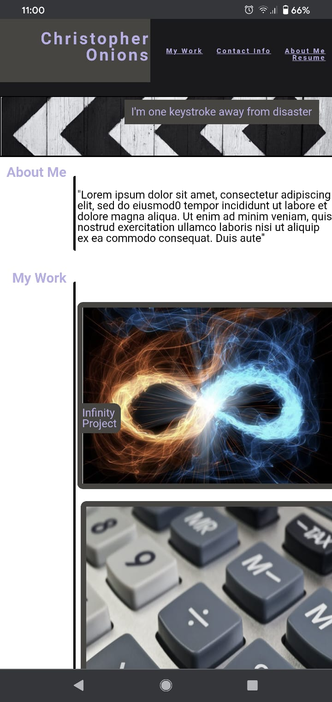

# Landing page 
###Christopher Onions


### Prerequisites

Can be opened in any text editor workspace

```
#### Example
Visual studio code
notepad++
```

## Built With:

*HTML
*Css
*reset.css (Link in recources)
*Visual Studio Code

### 

This was my first project, there were a few setbacks such as using flex over grid for a potentially better resault . 

https://chrisonions.github.io/Landing-page-For-Chris-Onions/.

## Authors

* I am the only author of this project.

### Prerequisites

Can be opened in any text editor workspace

```
 Example
-Visual studio code
-notepad++
```

## Built With:
```
-HTML
-Css
-reset.css (Link in recources)
-Visual Studio Code
```
##Challenges

-This was my first project, there were a few setbacks such as using flex over grid for a potentially better resault . 

-Getting text over an image took me at least 2 days of stuggleing but i pushed though and finally figured it out.

-i have put alot of work into this project and im proud of the outcome .

-features that i could add would just be functionality changes and some sizing issue i ran ot of time to fix.

-thank you for listeing to my ted talk. 

## Authors

* I am the only author of this project.

## Photos

##### Web


##### Mobile



## Acknowledgments

Stylesheet rescet.css
(https://meyerweb.com/eric/tools/css/reset/)[branch]/image.jpg?raw=true)


## Acknowledgments

Stylesheet rescet.css
(https://meyerweb.com/eric/tools/css/reset/)